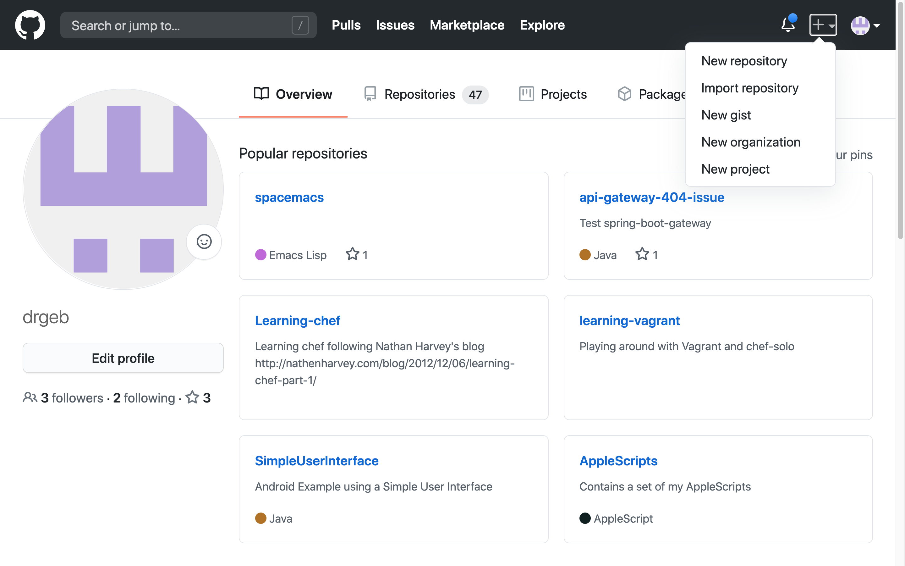

# Build My First Angular App

## Need git

### How to install git ?

### Step1: create Repo



### Step2: Push local repo to GitHub, our remote repo

``` shell
git remote add origin https://github.com/drgeb/LuisTest.git
git branch -M master
git push -u origin master
```
